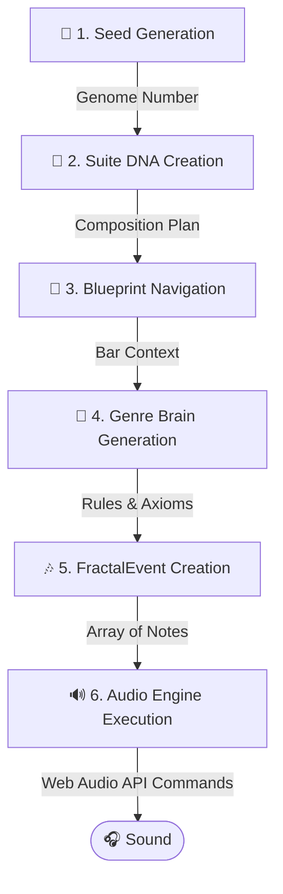

# Как рождается музыка в AuraGroove: от "Семя" до Звука

Весь процесс, от одного числа до богатого музыкального полотна, является детерминированным. Это означает, что одно и то же начальное "семя" всегда будет производить точно такое же музыкальное путешествие. Вот пошаговый разбор того, как это работает.

### Конвейер Генерации

```mermaid
graph TD;
    A[🌱 1. Генерация "Семя"] -->|Геномное число| B[🧬 2. Создание ДНК Сюиты];
    B -->|План композиции| C[🧭 3. Навигация по Чертежу];
    C -->|Контекст такта| D[🧠 4. Генерация "Мозгом" Жанра];
    D -->|Правила и Аксиомы| E[🎶 5. Создание FractalEvent];
    E -->|Массив нот| F[🔊 6. Исполнение Аудио-Движком];
    F -->|Команды Web Audio API| G([🎧 Звук]);
```

### Пошаговый разбор

1.  **🌱 Генерация "Семя" (Seed Generation):**
    Все начинается с одного 32-битного числа, `seed` (например, `1771865219446`). Это "геном" всего музыкального произведения. Он передается в генератор псевдослучайных чисел, обеспечивая воспроизводимость всего процесса генерации.

2.  **🧬 Создание ДНК Сюиты (Suite DNA Creation):**
    `seed` используется для генерации объекта `SuiteDNA` — генерального плана всей композиции (обычно на 160 тактов). Этот план музыкально осмыслен:
    *   **Карта Гармонии:** Последовательность аккордов создается с использованием **Цепей Маркова**, что обеспечивает логичное и приятное гармоническое развитие.
    *   **Карта Напряжения:** Генерируется кривая эмоционального напряжения для всего произведения, диктуя приливы и отливы музыкальной энергии.
    *   **Династия и Аксиомы:** Выбирается "Династия" — тщательно подобранный набор музыкальных фраз, "лик'ов" и стилистических идей (называемых **Аксиомами**), которые определят характер произведения.

3.  **🧭 Навигация по Чертежу (Blueprint Navigation):**
    `BlueprintNavigator` берет `SuiteDNA` и применяет его к структурному `MusicBlueprint` для выбранного жанра (например, 'blues'). Этот чертеж определяет структуру песни: `INTRO`, `MAIN`, `SOLO`, `BRIDGE`, `CODA` и т. д. На каждом такте навигатор определяет текущую секцию и ее конкретные правила инструментовки.

4.  **🧠 Генерация "Мозгом" Жанра (Genre Brain Generation):**
    Это творческое ядро. `FractalMusicEngine` делегирует задачу сочинения музыки для текущего такта специализированному "Мозгу" для этого жанра (`BluesBrain`, `TranceBrain` и т.д.). "Мозг" получает полный контекст: текущий аккорд, требуемый уровень напряжения, секцию песни и доступные Аксиомы.

5.  **🎶 Создание FractalEvent (FractalEvent Creation):**
    "Мозг" использует свою внутреннюю логику и предоставленный контекст для генерации массива объектов `FractalEvent`. `FractalEvent` — это единичная музыкальная инструкция, например, нота для воспроизведения:
    ```json
    {
      "type": "melody",
      "note": "C#4",
      "time": "0:1.5",
      "duration": "16n",
      "velocity": 0.85
    }
    ```
    "Мозг" не просто воспроизводит готовые фразы. Он применяет **фрактальные мутации** (инверсию, ретроградное движение, ритмический джиттер) к Аксиомам, создавая бесконечные, органичные вариации из конечного набора исходного материала.

6.  **🔊 Исполнение Аудио-Движком (Audio Engine Execution):**
    Основное приложение получает массив `FractalEvent`-ов и набор `instrumentHints` (например, `{ melody: 'telecaster' }`).
    *   Оно выбирает соответствующий источник звука: **сэмплер** для 'telecaster' или **синтезатор** для звука 'bass_house'.
    *   Оно планирует каждый `FractalEvent` с помощью нативного **Web Audio API** браузера (через библиотеку Tone.js), точно указывая, какую ноту играть, когда, как долго и с какой громкостью. В результате вы слышите звук в своих наушниках.

---

# How Music is Born in AuraGroove: From Seed to Sound

The entire process, from a single number to a rich musical tapestry, is deterministic. This means the same initial "seed" will always produce the exact same musical journey. Here’s a step-by-step breakdown of how it works.

### The Generation Pipeline



### Step-by-Step Breakdown

1.  **🌱 Seed Generation:**
    It all starts with a single 32-bit number, the `seed` (e.g., `1771865219446`). This is the "genome" of the entire musical piece. It's passed to a pseudo-random number generator, ensuring the entire generation process is reproducible.

2.  **🧬 Suite DNA Creation:**
    The `seed` is used to generate a `SuiteDNA` object—the master plan for the entire composition (typically 160 bars). This plan is musically intelligent:
    *   **Harmony Map:** A chord progression is created using **Markov Chains**, which provides a logical and pleasant harmonic development.
    *   **Tension Map:** A curve of emotional tension is generated for the entire piece, dictating the ebbs and flows of musical energy.
    *   **Dynasty and Axioms:** A "Dynasty" is chosen—a curated set of musical phrases, licks, and stylistic ideas (called **Axioms**) that will define the character of the piece.

3.  **🧭 Blueprint Navigation:**
    The `BlueprintNavigator` takes the `SuiteDNA` and applies it to a structural `MusicBlueprint` for the selected genre (e.g., 'blues'). This blueprint defines the song structure: `INTRO`, `MAIN`, `SOLO`, `BRIDGE`, `CODA`, etc. On every bar, the navigator determines the current section and its specific instrumentation rules.

4.  **🧠 Genre Brain Generation:**
    This is the creative core. The `FractalMusicEngine` delegates the task of composing the music for the current bar to a specialized "Brain" for that genre (`BluesBrain`, `TranceBrain`, etc.). The Brain receives the full context: the current chord, the required tension level, the song section, and the available Axioms.

5.  **🎶 FractalEvent Creation:**
    The "Brain" uses its internal logic and the provided context to generate an array of `FractalEvent` objects. A `FractalEvent` is a single musical instruction, like a note to be played:
    ```json
    {
      "type": "melody",
      "note": "C#4",
      "time": "0:1.5",
      "duration": "16n",
      "velocity": 0.85
    }
    ```
    The Brain doesn't just play back pre-made phrases. It applies **fractal mutations** (inversion, retrograde, rhythmic jitter) to the Axioms, creating endless, organic variations from a finite set of source material.

6.  **🔊 Audio Engine Execution:**
    The main application receives the array of `FractalEvent`s and a set of `instrumentHints` (e.g., `{ melody: 'telecaster' }`).
    *   It selects the appropriate sound source: a **sampler** for a 'telecaster' or a **synth** for a 'bass_house' sound.
    *   It schedules each `FractalEvent` with the browser's native **Web Audio API** (via the Tone.js library), precisely specifying which note to play, when, for how long, and how loudly. The result is the sound you hear in your headphones.
