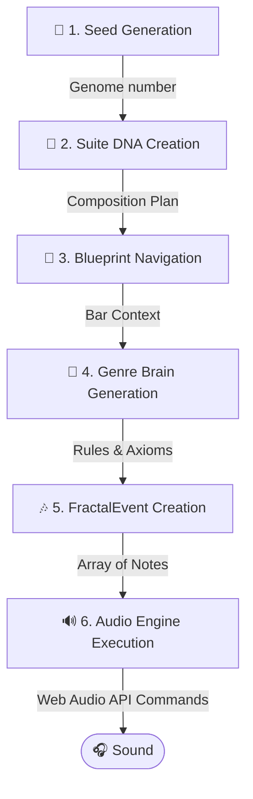

# AuraGroove V2

> A generative music engine that creates unique, real-time soundscapes, designed to run flawlessly on any device.

## Core Philosophy: Performance as a Feature

AuraGroove is built on a simple premise: generative music should be accessible to everyone, on any device, without compromising on depth or quality. This is achieved through a highly-optimized, custom-built audio engine that prioritizes performance above all else.

We consciously avoid heavy, all-in-one libraries for sound generation. Instead, AuraGroove uses a **heterogeneous audio engine**, where each task is handled by the most efficient tool for the job. This means:

*   **For complex, harmonically rich sounds**, like acoustic instruments, we use high-quality **samplers**. This provides incredible realism without the computational overhead of real-time synthesis.
*   **For more electronic and dynamic sounds**, such as basslines and synthesizer pads, we leverage **real-time synthesis**. This offers maximum flexibility and expressiveness.
*   **Heavy lifting is offloaded to Web Workers.** Complex calculations for music generation and audio processing happen in the background, ensuring a smooth, glitch-free user experience, even on low-powered devices.

This modular, performance-first approach allows AuraGroove to deliver a rich, immersive musical experience that is both sophisticated and universally accessible.

## How Music is Born: From Seed to Sound

The entire process, from a single number to a rich musical tapestry, is deterministic. This means the same initial "seed" will always produce the exact same musical journey. Here’s a step-by-step look at how it works.

### The Generation Pipeline



### Step-by-Step Breakdown

1.  **🌱 Seed Generation:**
    It all starts with a single 32-bit number, the `seed` (e.g., `1771865219446`). This is the "genome" of the entire musical piece. It feeds a pseudo-random number generator, ensuring that the entire generation process is reproducible.

2.  **🧬 Suite DNA Creation:**
    The `seed` is used to generate a `SuiteDNA` object, which is the master plan for the entire composition (typically 160 bars). This is not just random; it's musically intelligent:
    *   **Harmony Map:** A chord progression is created using **Markov Chains**, ensuring a logical and pleasant harmonic development.
    *   **Tension Map:** A curve of emotional tension is generated for the entire piece, dictating the ebb and flow of musical energy.
    *   **Dynasty & Axioms:** A "Dynasty" is chosen—a curated set of musical phrases, licks, and stylistic ideas (called **Axioms**) that will define the character of the piece.

3.  **🧭 Blueprint Navigation:**
    The `BlueprintNavigator` takes the `SuiteDNA` and applies it to a structural `MusicBlueprint` for the selected genre (e.g., 'blues'). This blueprint defines the song structure: `INTRO`, `MAIN`, `SOLO`, `BRIDGE`, `CODA`, etc. On every bar, the navigator determines the current section and its specific instrumentation rules.

4.  **🧠 Genre Brain Generation:**
    This is the creative core. The `FractalMusicEngine` delegates the task of composing the music for the current bar to a specialized "Brain" for that genre (`BluesBrain`, `TranceBrain`, etc.). The Brain receives the full context: the current chord, the required tension level, the song section, and the available Axioms.

5.  **🎶 FractalEvent Creation:**
    The "Brain" uses its internal logic and the provided context to generate an array of `FractalEvent` objects. A `FractalEvent` is a single musical instruction, like a note to be played:
    ```json
    {
      "type": "melody",
      "note": "C#4",
      "time": "0:1.5",
      "duration": "16n",
      "velocity": 0.85
    }
    ```
    The Brain doesn't just play back pre-made phrases. It applies **fractal mutations** (inversion, retrograde, rhythmic jitter) to the Axioms, creating endless, organic variations from a finite set of source material.

6.  **🔊 Audio Engine Execution:**
    The main application receives the array of `FractalEvent`s and a set of `instrumentHints` (e.g., `{ melody: 'telecaster' }`).
    *   It selects the appropriate sound source: a **sampler** for a 'telecaster', or a **synth** for a 'bass_house' sound.
    *   It schedules each `FractalEvent` with the browser's native **Web Audio API** (via the Tone.js library), telling it exactly which note to play, when to play it, for how long, and how loudly. The result is the sound you hear in your headphones.

